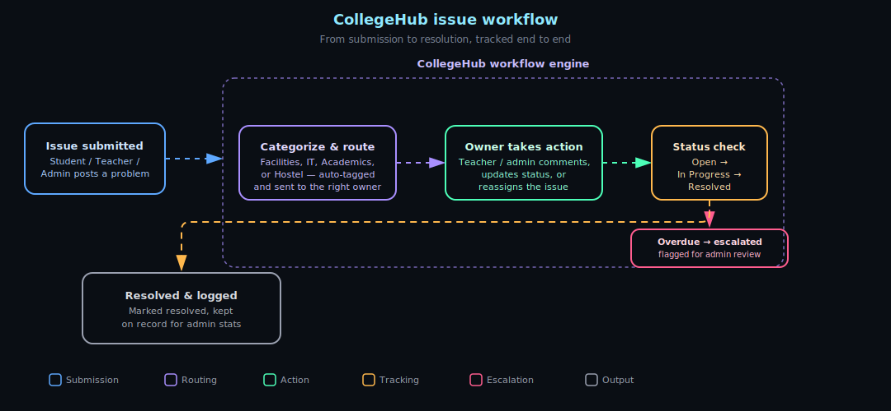

# 🎓 CollegeHub

An interactive issue management system for colleges. 🏫 Students, teachers, and admins all share one place to **post problems, track them, and get them resolved** — instead of losing them in email threads, WhatsApp groups, or a complaint box nobody checks.

Think of it as a help desk built for campus life: a leaking classroom ceiling, a broken lab computer, a timetable clash, a fee-portal glitch — anyone raises it, the right people see it, and everyone can follow it through to "resolved." ✅

---

---

---

## 🎮 CollegeHub Triage Challenge


An issue just came in. Pick the right category before you reveal the answer — 8 rounds, track your score as you go.

**Category key:**


<br>

### Round 1
> 💬 *"Wi-Fi drops every time more than 10 people join the same lecture hall call."*

<details><summary>🔍 Reveal category</summary><br>


Easy to misfile as a building issue — but it's a network capacity problem.
</details>

### Round 2
> 💬 *"The ceiling in Room 204 is leaking whenever it rains."*

<details><summary>🔍 Reveal category</summary><br>


</details>

### Round 3
> 💬 *"Two core courses got scheduled in the same time slot this semester."*

<details><summary>🔍 Reveal category</summary><br>


</details>

### Round 4
> 💬 *"The hostel mess hasn't had hot water for three days."*

<details><summary>🔍 Reveal category</summary><br>


</details>

### Round 5
> 💬 *"The fee-payment portal keeps timing out at the last step."*

<details><summary>🔍 Reveal category</summary><br>


</details>

### Round 6
> 💬 *"Exam hall seating chart has the same seat assigned to two students."*

<details><summary>🔍 Reveal category</summary><br>


</details>

### Round 7
> 💬 *"Room allocation mix-up left two students without a hostel bed."*

<details><summary>🔍 Reveal category</summary><br>


</details>

### Round 8
> 💬 *"A tube light has been flickering in the library reading room for a week."*

<details><summary>🔍 Reveal category</summary><br>


</details>

<br>

**Your rank:**

 
 


---

---

## ✨ Features

### 👩‍🎓 For Students
- 📝 Post a problem with a title, description, and category (facilities, academics, IT, hostel, etc.)
- 📎 Attach photos or files as proof
- 🔍 Track the status of your issues: *Open → In Progress → Resolved*
- 💬 Comment on your issue to add details or reply to staff
- 🔔 Get notified when someone updates or resolves your problem

### 👨‍🏫 For Teachers
- 📥 View issues assigned to them or relevant to their department
- ✍️ Respond to students, ask for more info, and post updates
- 🔁 Change an issue's status as it gets worked on
- ⬆️ Escalate problems that need admin attention

### 🛡️ For Admins
- 🗂️ See every issue across the college in one dashboard
- 🎯 Assign issues to the right teacher, department, or staff member
- 👥 Manage users and their roles (student / teacher / admin)
- 📊 View stats — how many issues are open, average resolution time, busiest categories
- 🏁 Close out resolved issues and keep a record

---

## 🧰 Tech Stack

> ✏️ *Fill these in with what you actually used.*

- **Frontend:** `[React]`
- **Backend:** `[Node.js + Express]`
- **Database:** `[MongoDB]`
- **Authentication:** `[JWT]`

---

## 🚀 Getting Started

### 📋 Prerequisites
> ✏️ *Adjust to match your stack.*
- `[e.g. Node.js 18+]`
- `[e.g. a running database instance]`

### 🛠️ Installation

```bash
# 1. Clone the repo
git clone https://github.com/your-username/college-hub.git
cd college-hub

# 2. Install dependencies
[e.g. npm install]

# 3. Set up your environment variables
cp .env.example .env
# then fill in your database URL, secret keys, etc.

# 4. Start the app
[e.g. npm start]
```

Once it's running, open 👉 `http://localhost:3000` (or whatever port you've set) in your browser.

---

## 🔑 User Roles at a Glance

| Role | Can post issues | Can resolve issues | Can manage users |
|------|:---:|:---:|:---:|
| 👩‍🎓 Student | ✅ | ❌ | ❌ |
| 👨‍🏫 Teacher | ✅ | ✅ | ❌ |
| 🛡️ Admin | ✅ | ✅ | ✅ |

---
## Architecture


## 📖 How It Works

1. 🔐 A user logs in and lands on a dashboard suited to their role.
2. 📝 A student (or anyone) posts a problem with details and an optional attachment.
3. 🎯 An admin or teacher picks it up and assigns or starts working on it.
4. 💬 Everyone involved can comment and watch the status change.
5. ✅ Once it's fixed, it's marked resolved — and it stays on record for reference.

---
